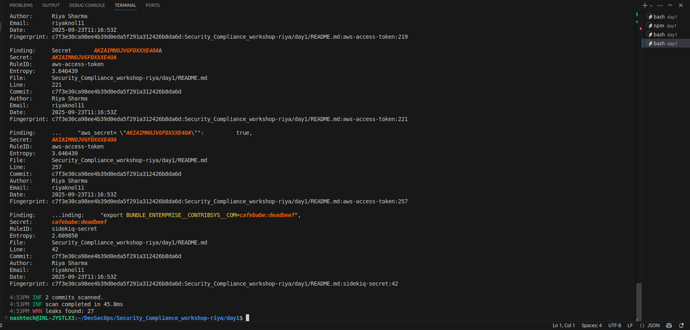
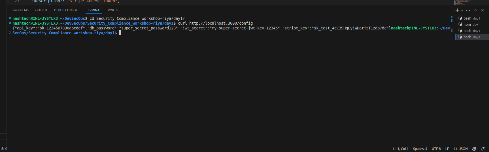

# DevSecOps Assignment: Shift-Left Security Implementation

## Overview
This project demonstrates shift-left security principles by implementing secret scanning with Gitleaks and secure deployment practices.

## Implementation steps

` Step 1 :  Created Vulnerable Application and Dockerfile `

- Created app.js with intentional hardcoded secrets:
- Database passwords
- API keys (Stripe, AWS)
- JWT secrets
- GitHub tokens
- Connection strings

` Step 2 : Gitleaks Configuration and Scanning `
- Initially used default Gitleaks rules which include detection for:

    - API keys (patterns like sk-, pk-)
    - Database passwords
    - AWS credentials (AKIA*)
    - GitHub tokens (ghp_*)
    - JWT secrets
    - Connection strings

Command used for scanning:

- Run Gitleaks scan with verbose output

    `` gitleaks detect --source . --verbose ``

- Generate detailed JSON report

    `` gitleaks detect --source . --report-format json --report-path gitleaks-before.json ``

### Secrets Detected (Before Remediation):

` Initial Scan Results `

` Step 3 : Security Remediation `

- Environment Variables Implementation
- Created .env file in git root:
- Updated Application Code
- Secure app.js implementation:
- Secure Dockerfile

` Step 4 : Verification and Testing `
- Clean Gitleaks Scan
- Commands used for verification:

 - Run clean scan

    ` gitleaks detect --source . --verbose`

- Generate clean report

    ` gitleaks detect --source . --report-format json --report-path gitleaks-clean.json`

    

### Core Concept Questions - Answers
#### 1. Explain shift-left security and its importance
Answer:
Shift-left security means integrating security practices early in the software development lifecycle (SDLC) rather than treating security as an afterthought. The term "shift-left" refers to moving security activities to the left side of the development timeline.
Importance:

- Cost Reduction: Fixing vulnerabilities in development is 6-10x cheaper than in production
- Faster Remediation: Developers can fix issues while the code is fresh in their minds
- Reduced Risk: Prevents vulnerabilities from reaching production
- Compliance: Helps meet regulatory requirements early
- Cultural Change: Makes security everyone's responsibility, not just the security team's

#### 2. How detecting secrets early prevents production vulnerabilities
Answer:
Early secret detection prevents:

- Data Breaches: Exposed API keys can't be used maliciously
- Privilege Escalation: Database passwords can't be exploited
- Financial Loss: Payment processing keys can't be misused
- Reputation Damage: Public repositories won't expose credentials
- Compliance Violations: Avoids regulatory fines for data exposure

Pipeline Benefits:

- Automated scanning catches human errors
- Blocks commits/deployments with secrets
- Creates audit trails
- Educates developers about secure practices

#### 3. Strategies for secure secret storage
Strategies:

1. Environment Variables: Store in OS environment, not code
2. Secret Management Services:
- AWS Secrets Manager
- Azure Key Vault
- HashiCorp Vault
- Google Secret Manager

3. Container Secrets: Docker secrets, Kubernetes secrets.
4. Configuration Management: Ansible Vault, Chef encrypted data bags
5. Runtime Injection: Load secrets at runtime, never at build time
6. Principle of Least Privilege: Minimal access scope and duration
7. Secret Rotation: Regular rotation of sensitive credentials

#### 4. Secret exposure scenarios and prevention
Scenarios where secrets could still be exposed:

1. Runtime Logs: Secrets printed to application logs

- Prevention: Use structured logging, filter sensitive fields

2. Error Messages: Stack traces exposing connection strings

- Prevention: Generic error messages, proper exception handling

3. Memory Dumps: Secrets visible in process memory

- Prevention: Clear sensitive variables after use, use secure memory

4. Environment Variable Leaks: Process lists showing env vars

- Prevention: Use secret management APIs instead of env vars for highly sensitive data

5. Git History: Secrets removed from current code but in commit history

- Prevention: Rewrite git history, rotate exposed secrets

6. Docker Images: Secrets baked into image layers

- Prevention: Use multi-stage builds, runtime secret injection